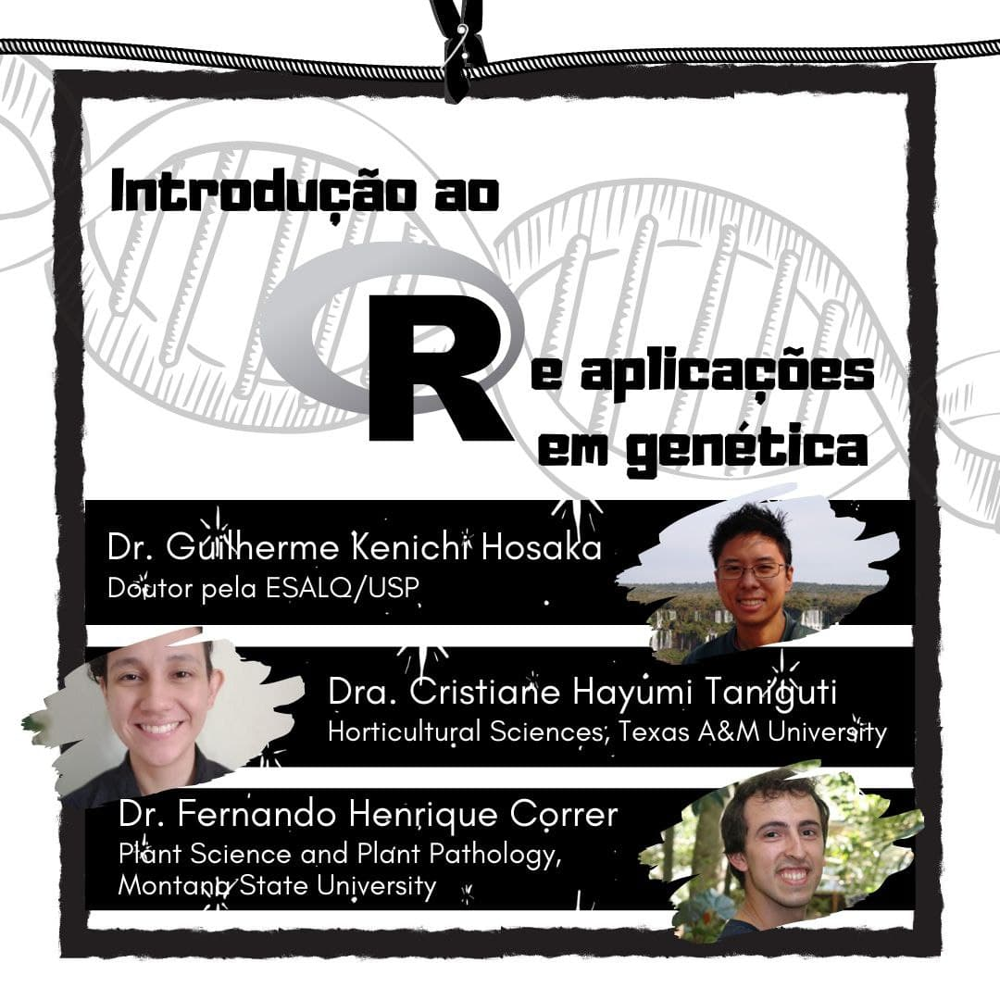

---
output:
  prettydoc::html_pretty:
    theme: cayman
    highlight: github
---

# Introdução ao R e aplicações em Genética

## Sobre o curso

Nos dias 08 e 09 de setembro de 2021, ofereceremos o minicurso **Introdução ao R e aplicações em Genética** como parte da [11ª Semana Integrada da Graduação e Pós-Graduação do Instituto de Física de São Carlos](https://sifsc.ifsc.usp.br/).

Este curso é voltado para aqueles que querem entender os conceitos básicos da linguagem R. Nossos esforços se concentrarão em exemplos de Genética, mostrando a importância da linguagem para estudos nessa área do conhecimento.  Para isso, abordaremos os seguintes temas:

* Apresentação teórica sobre o R e importância da programação

* Live coding em R, cobrindo os tópicos:

   * Familiarização com a interface do RStudio
   
   * Operações básicas
   
   * Tipos de objetos

   * Importação e exportação de dados
   
   * Estruturas condicionais
   
   * Estruturas de repetição
   
   * Gráficos simples
   
   * Um exemplo didático de aplicação em genética
   
   * Instalação e aplicação de pacotes

* Apresentação teórica sobre aplicações em Genética

O treinamento de Programação em R é ofertado desde 2015 por alunos do Departamento de Genética. Você pode encontrar o material utilizado em anos anteriores neste [site](http://cristianetaniguti.github.io/Workshop_genetica_esalq/).

## Materiais

Aqui será disponibilizado o material que será utilizado no **Introdução ao R e aplicações em Genética**.

* [Tutorial de instalação do R, RStudio e pacotes que serão utilizados](Tutorial_instalacao.html)
* [Introdução](Introducao.pdf)
* [**Tutorial principal**](cursoR.html)
* [Exercícios](exercicios.html)